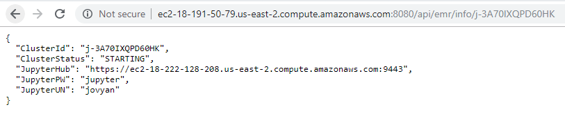
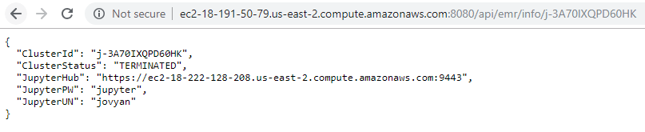
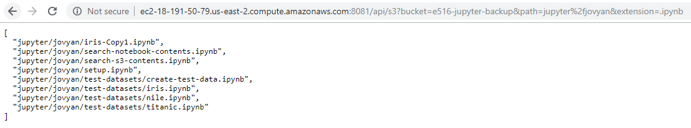
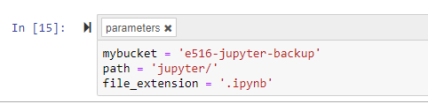
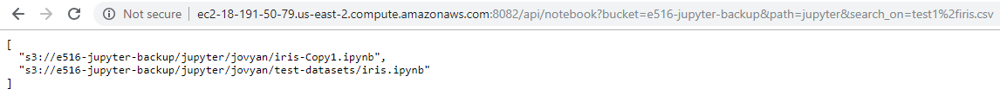

# Open API with AWS EMR and Jupyter

| Ian Sims
| isims@iu.edu
| Indiana University
| hid: fa18-516-22
| github: [:cloud:](https://github.com/cloudmesh-community/fa18-516-22/blob/master/project-report/report.md)
| code: [:cloud:](https://github.com/cloudmesh-community/fa18-516-22/project-code/README.md)

---

Keywords: AWS, Open API, EC2, EMR, Jupyter, S3

---

**:mortar_board: Learning Objectives**

* Use Open API to interact with various AWS products
* Learn to deploy an AWS EMR Cluster
* Interact with Jupyter notebooks stored in S3 buckets

## Abstract

The goal of this project is to create an AWS cloud environment to facilitate analytical work at scale. This includes creating an API to facilitate the creation of an analytical environment as well as APIs to aid a user in determining the types of analytical processes that already exist.

Specifically, this project involves building an API for the creation of an AWS EMR cluster and APIs to give users the ability to determine available analytical datasets on AWS S3. Finally, we will create an API that interacts with the S3 API and gives the abilty to parse through Jupyter notebook files to determine which analytical processes utilize a given dataset.

The project architecture can be visualized as follows:

+@fig:project-architecture shows the proposed architecture for this project

{#fig:project-architecture}

## Introduction

The following provides a description of the different technologies and products that were used in the project.

### Open API

Rest API's allow for the creation of services that can interact with multiple applications. This project will seek to develop an API for interacting with various AWS products. These products include AWS EMR and S3. In addition, these APIs will be hosted on an AWS EC2 instance.

Open API is an open source project intended to create a consistent format for creating REST services. Open API descripes this project as:

> "The OpenAPI Initiative (OAI) was created by a consortium of forward-looking industry experts who recognize the immense value of standardizing on how REST APIs are described." [@fa18-516-22-OpenAPI]

### AWS EMR

EMR is an Amazon product that allows for the creation of clusters of Elastic Compute Cloud (EC2) instances. EMR allows user to take advantage of distributed computing capabilities. As the name suggests this product is designed to allow users to easily scale their cluster to meet their computing needs.

EMR clusters can be created through relatively simple web interfaces or can be created through code using CLI. EMR Clusters can be configured for size and can be provisioned with open-source distributed frameworks such as SPARK and HBase.

For this project we will interact with EMR using an API. This API will allow for the creationand termination of an EMR cluster. It will also allow a user to retrieve the status of an EMR cluster. This EMR cluster will also include the installation of Jupyter Hub to enable the development of notebooks for analytical purposes.

### AWS EC2

EC2 is an Amazon product that enables cloud computing. Amazon describes this product as:

> "Amazon Elastic Compute Cloud (Amazon EC2) is a web service that provides secure, resizable compute capacity in the cloud. It is designed to make web-scale cloud computing easier for developers." [@fa18-516-22-AWSEC2]

For this project APIs will be hosted on an EC2 instance.

### AWS S3

S3 is one of Aamzon's data storage solutions. For this project we will configure an EMR cluster to read/write to an S3 bucket. This bucket would potentially be used for accessing data for analytical purposes and to store log files associated with the cluster. In addition, the Jupyter Hub instance installed on the EMR cluster will store created notebooks on S3. This will allow for terminating the cluster when it is not in use with the ability to retrieve saved notebooks for future use.

### JupyterHub

JupyterHub is an open-source project intended to allow a wide range of users to interact with and organize notebooks for analysis. The open-source project describes JupyterHub as follows:

> "JupyterHub brings the power of notebooks to groups of users. It gives users access to computational environments and resources without burdening the users with installation and maintenance tasks. Users - including students, researchers, and data scientists - can get their work done in their own workspaces on shared resources which can be managed efficiently by system administrators." [@fa18-516-22-JupyterHub]

For this project we will build an API that creates an Amazon EMR cluster that includes an installation of JupyterHub.

## Implemenation

### Setting up AWS CLI

After setting up an AWS account account: [AWS Account](https://github.com/cloudmesh-community/book/blob/master/chapters/iaas/aws/aws.md#creating-an-account) and an [AWS Key Pair](https://github.com/cloudmesh-community/book/blob/master/chapters/iaas/aws/aws.md#setting-up-key-pair), we needed to be able to work with AWS products from the command line. To do this we utilized the AWS Command-Line Interface (CLI) from a Linux envirionment.

First we set up a [Linux](https://github.com/cloudmesh-community/book/blob/master/chapters/linux/linux.md) environment using VirtualBox. We then installed [Python](https://github.com/cloudmesh-community/book/blob/master/chapters/prg/python/python-install.md) and [PIP](https://pip.pypa.io/en/stable/installing/) on that environment. Finally we installed CLI using the following Bash command:

```bash
$ pip install awscli
```
The following item had to be configured for CLI:

* AWS Access Key ID
* AWS Secret Access Key
* Default region name (this is the default region that will be used when you create EC2 instances)
* Default output format (the default format is json)

### Setting up AWS Admin Access

In order to work from the command line with various AWS products we had to set up admin access. Using CLI we ran the following commands:

```bash
$ aws iam create-group --group-name Admins
```

```bash
$ aws iam attach-group-policy --group-name Admins --policy-arn arn:aws:iam::aws:policy/AdministratorAccess
```

Then through the [AWS Console](https://console.aws.amazon.com/iam/home?region=us-east-2#/groups) we assigned users to the admin group. Under 'Group Actions', we selected 'Add Users to Group'.

+@fig:aws-admin-access shows the AWS Console screen for adding users to a admin security group

![AWS Security [@fa18-516-22-AWS-Security-1]](images/fa18-516-22-aws-api-1.png){#fig:aws-admin-access}

### Creating and Configuring EC2 Instance to Host API

#### EC2 Security Group

To set up the EC2 instance for hosting our APIs we first used the Amazon Console to set up a security group.

Navigating to: [EC2 Security Group](https://us-east-2.console.aws.amazon.com/ec2/v2/home?region=us-east-2#SecurityGroups:sort=groupId) we selected 'Create Security Group'

+@fig:aws-create-security-groups shows the screen to create an AWS security group

![AWS Security [@fa18-516-22-AWS-Security-2]](images/fa18-516-22-aws-api-2.png){#fig:aws-create-security-groups}


We then gave the security group a name, selected the default VPC and added two rules. One that opens ports 8080, 8081, and 8082 for http traffic and one to allow ssh access from a single ip. Ports 8080, 8081, and 8082 will be used for accessing the APIs.

+@fig:aws-define-security-group shows the AWS screen for defining a security group

![AWS Security [@fa18-516-22-AWS-Security-2]](images/fa18-516-22-aws-api-3.png){#fig:aws-define-security-group}

#### EC2 Create Instance

Now it was time to create an EC2 instance using the AWS Console: [Launch EC2](https://us-east-2.console.aws.amazon.com/ec2/v2/home?region=us-east-2#Instances:sort=instanceId). We clicked the 'Launch Instance' button.

+@fig:launch-ec2 shows the AWS Console screen for launching an EC2 instance

![AWS EC2 [@fa18-516-22-AWS-EC2-1]](images/fa18-516-22-aws-api-4.png){#fig:launch-ec2}

We selected the Ubuntu version, using version 18.04:

+@fig:ec2-define-os shows the AWS screen used for selecting an EC2 operating system

![AWS EC2 OS [@fa18-516-22-AWS-EC2-1]](images/fa18-516-22-aws-api-5.png){#fig:ec2-define-os}

We selected a small instance type and went to "Next: Configure Instance Details.

+@fig:ec2-select-type shows the AWS Console screen for selecting the type of instance

![AWS EC2 Type [@fa18-516-22-AWS-EC2-1]](images/fa18-516-22-aws-api-6.png){#fig:ec2-select-type}

We made sure the default VPC is selected and then went to 'Configure Security Group'.

+@fig:ec2-configure-security shows the AWS Console screen for confirguring securty on an EC2 instance

![AWS EC2 Security Config [@fa18-516-22-AWS-EC2-1]](images/fa18-516-22-aws-api-7.png){#fig:ec2-configure-security}

We clicked 'Select and existing security group' and selected the group created earlier.

+@fig:ec2-select-security shows the AWS Console screen for selecting a security group for EC2

![AWS EC2 Security Select [@fa18-516-22-AWS-EC2-1]](images/fa18-516-22-aws-api-8.png){#fig:ec2-select-security}

The EC2 instance could then be launched.

#### EC2 SSH

We then went into to a local Linux environment and set up a key pair to enable ssh to our EC2 instance. We did this using CLI and the following commands:

```bash
$ aws ec2 create-key-pair --key-name dlec2-key --query 'KeyMaterial' --output text > dlec2-key.pem
```

Allowed access to the key:
```bash
$ chmod 400 dlec2-key.pem
```

Then locating the 'Public DNS' at: [AWS EC2](https://us-east-2.console.aws.amazon.com/ec2/v2/home?region=us-east-2#Instances:sort=instanceId), we connected to the EC2 instance with the following command:

```bash
$ ssh -i "dlec2-key.pem" ubuntu@ec2-18-191-50-79.us-east-2.compute.amazonaws.com
```

#### EC2 Set Up

We then set up a Python virtual environment for our rest services:

```bash
$ pyenv install -l
$ pyenv install 3.6.6
$ pyenv virtualenv 3.6.6 RestService
$ pyenv activate RestService
```

Installed AWS CLI

```bash
$ pip install awscli
```
The following items had to be configured for CLI:

* AWS Access Key ID
* AWS Secret Access Key
* Default region name (this is the default region that will be used when you create EC2 instances)
* Default output format (the default format is json)

### Create S3 Storage

In order to store analytical data and to backup our Jupyter notebooks We created two S3 buckets using the following commands:

```bash
$ aws s3 mb s3://e516-analytical-datasets --region us-east-2
$ aws s3 mb s3://e516-jupyter-backup --region us-east-2
```

### Codegen Set Up

#### Install Java

We used Codegen to create our rest services and Java is a requirement. We installed Java using the following commands:

```bash
$ sudo apt update
$ sudo apt install default-jre
$ sudo apt install default-jdk
```

#### Install Codegen

We ran the following commands for installation:

```bash
$ mkdir ~/e516/swagger
$ cd ~/e516/swagger
$ wget https://oss.sonatype.org/content/repositories/releases/io/swagger/swagger-codegen-cli/2.3.1/swagger-codegen-cli-2.3.1.jar
```

We then opened the .bashrcls file and added an alias for codegen:

```bash
alias swagger-codegen="java -jar ~/e516/swagger/swagger-codegen-cli-2.3.1.jar"
```

### Building the EMR Rest Service

#### Swagger YAML Specs

Using Swagger we built the API specs. This API has POST, DELETE, and GET methods. The POST method will create an AWS EMR cluster and install JupyterHub. The DELETE method allows for the termination of the cluster. The GET method retrieves information about the cluster including the status and a link to the Jupyter Hub web ui.

```yaml
swagger: "2.0"
info:
  version: "0.0.1"
  title: "emrinfo"
  description: "API to spin up an AWS EMR cluster, to check status, and to terminate."
  termsOfService: "http://swagger.io/terms/"
  contact:
    name: "EMR Rest Service"
  license:
    name: "Apache"
host: 18.191.50.79:8080
basePath: /api
schemes:
  - http
consumes:
  - "application/json"
produces:
  - "application/json"
paths:
  /emr/create/{num_of_nodes}:
    post:
      summary: Create EMR cluster.
      parameters:
        - in: path
          name: num_of_nodes
          required: true
          type: integer
          minimum: 1
          description: The number of nodes in the cluster
      responses:
        200:
          description: OK
  /emr/info/{cluster_id}:
    get:
      summary: Returns EMR cluster Info.
      parameters:
        - in: path
          name: cluster_id
          required: true
          type: string
          minimum: 1
          description: The cluster id for EMR
      responses:
        200:
          description: OK
  /emr/terminate/{cluster_id}:
    delete:
      summary: Deletes EMR cluster.
      parameters:
        - in: path
          name: cluster_id
          required: true
          type: string
          minimum: 1
          description: The cluster id for EMR
      responses:
        200:
          description: OK
definitions:
  EMR:
    type: "object"
    required:
      - "model"
    properties:
      model:
        type: "string"
```

#### Deploy EMR Rest Service

As mentioned, we used Swagger Codegen for the creation of our APIs. Once our swagger yaml files was cloned to our EC2 instance we ran the following code to create the needed files:

```bash
$ swagger-codegen generate \
    -i ~/fa18-516-22/project-code/emr-api.yaml \
    -l python-flask \
    -o ~/emr-api/server/emr/flaskConnexion \
    -D supportPython3=true
```

We then navigated to our conroller file and edited it using nano:

```bash
$ cd ~/emr-api/server/emr/flaskConnexion/swagger_server/controllers
$ nano default_controller.py
```
We then updated our POST, DELETE, and GET methods with the Python functions we created. The POST method accepts a parameter indicating the number of instances desired in a cluster and will the create an AWS EMR cluster, configure it and install JupyterHub. This includes setting up the security foor the EMR cluster and specifying S3 buckets for it to interact with. It returns a dictionary that includes the creaed cluster's ID, a link to the GET method for checking the status of the cluster, and a curl command for executing the DELETE method for terminating the cluster.

```python
import subprocess

def emr_post(num_nodes):

   aws_cmd = "aws emr create-cluster --name=\'E516-JupyterHub-Cluster\'"
   aws_cmd = aws_cmd + " --release-label emr-5.19.0"
   aws_cmd = aws_cmd + " --applications Name=JupyterHub"
   aws_cmd = aws_cmd + " --log-uri s3://e516-jupyterhub-backup/JupyterClusterLogs"
   aws_cmd = aws_cmd + " --use-default-roles"
   aws_cmd = aws_cmd + " --ec2-attributes SubnetIds=subnet-d0169eaa,KeyName=dlec2-key,AdditionalMasterSecurityGroups=[\'sg-01c1d97ca12d1f2e7\']"
   aws_cmd = aws_cmd + " --instance-count " + str(num_nodes)
   aws_cmd = aws_cmd + " --instance-type m4.large"
   aws_cmd = aws_cmd + " --configurations \'[{\"Classification\":\"jupyter-s3-conf\",\"Properties\":{\"s3.persistence.bucket\":\"e516-jupyter-backup\",\"s3.persistence.enabled\":\"true\"},\"Configurations\":[]}]\'"
   aws_cmd = aws_cmd + " --output text"

   c_id = subprocess.run(aws_cmd, shell=True, stdout=subprocess.PIPE)

   cid = c_id.stdout.decode('utf-8')
   cid = cid.rstrip()

   c_status = "http://ec2-18-191-50-79.us-east-2.compute.amazonaws.com:8080/api/emr/info/" + cid
   t_clstr = 'curl -X "DELETE" http://ec2-18-191-50-79.us-east-2.compute.amazonaws.com:8080/api/emr/terminate/' + cid

   rtn_dict = {
      "ClusterId": cid,
      "CheckClusterStatus": c_status,
      "TerminateCluster": t_clstr
   }

   return rtn_dict
```

The DELETE method accepts an EMR cluster ID as an input and then terminates the specified EMR cluster. It returns a dictionary containing the cluster ID, the current status of the cluster, and the url for using the GET method to check the status of the cluster.

```python
import subprocess

def emr_delete(cid):

     subprocess.run("aws emr terminate-clusters --cluster-ids " + cid, shell=True)

     c_status = ("http://ec2-18-191-50-79.us-east-2.compute.amazonaws.com:8080/api/emr/info/" + cid)

     rtn_dict =   {
         "ClusterId": cid,
         "Status": "TERMINATING",
         "CheckClusterStatus": c_status
     }

     return rtn_dict
 ```
 
The GET method allows a use to query information about the EMR cluster. The method accepts a cluster ID as an input and returns a dictionary containing the cluster ID, the cluster status, a link to access the JupyterHub UI, as well as the default username and password for JupyterHub.

This function utilizes the Python library 'boto3'. This is a library created by Amazon to interact with AWS products with Python directly.
 
 ```python
import boto3

def emr_get(cid):

     client = boto3.client('emr')
     c_info = client.describe_cluster(ClusterId=cid)

     c_status = c_info["Cluster"]["Status"]["State"]
     if "MasterPublicDnsName" in c_info["Cluster"]:
          j_hub = ("https://" + c_info["Cluster"]["MasterPublicDnsName"] + ":9443")
          j_un = "jovyan"
          j_pw = "jupyter"
     else:
          j_hub = ""
          j_un = ""
          j_pw = ""

     rtn_dict = {
          "ClusterId": cid,
          "ClusterStatus": c_status,
          "JupyterHub": j_hub,
          "JupyterUN": j_un,
          "JupyterPW": j_pw
     }

     return rtn_dict
```
Once the default_controller.py file was updated, we activated this rest service using the following commands.

```bash
$ cd ~/emr-api/server/emr/flaskConnexion
$ pip install -r requirements.txt
$ python setup.py install
$ python -m swagger_server
```

The POST method could then be accessed using a curl command. In this case we will only specify two instances to be included in the cluster (the example output is incuded)

```bash
$ curl -X POST http://ec2-18-191-50-79.us-east-2.compute.amazonaws.com:8080/api/emr/create/2
{
  "CheckClusterStatus": "http://ec2-18-191-50-79.us-east-2.compute.amazonaws.com:8080/api/emr/info/j-3A70IXQPD60HK",
  "ClusterId": "j-3A70IXQPD60HK",
  "TerminateCluster": "curl -X DELETE http://ec2-18-191-50-79.us-east-2.compute.amazonaws.com:8080/api/emr/terminate/j-3A70IXQPD60HK"
}
```

The CheckClusterStatus url can then be used in a web browser to check the cluster's status.

+@fig:emr-get-output shows the results of executing the GET method for the EMR API

{#fig:emr-get-output}

Once the cluster is started, the JupyterHub web interface can be accessed through the given url. The EMR API configured the cluster to store created notebook to S3, so when the cluster is terminated the notebooks will still be persisted. In addition, each time the POST method is used to create an EMR cluster any persisted notebooks will be available to the user in JupyterHub.

The DELETE method can be used in a curl command to terminate the cluster.

```bash
$ curl -X DELETE http://ec2-18-191-50-79.us-east-2.compute.amazonaws.com:8080/api/emr/terminate/j-3A70IXQPD60HK
{
  "CheckClusterStatus": "http://ec2-18-191-50-79.us-east-2.compute.amazonaws.com:8080/api/emr/info/j-3A70IXQPD60HK",
  "ClusterId": "j-3A70IXQPD60HK",
  "Status": "TERMINATING"
}
```

Using the GET method shows that the cluster has been terminated

+@fig:emr-get-output-results shows the results of executing the GET method for the EMR API

{#fig:emr-get-output-results}

### Deploy S3 Rest Service

This rest service was meant to provide an abstraction layer that can be used by another rest service. This API provides a simple function to query the contents of an AWS S3 bucket and return the keys to any files that meet a specified file extension type. The Swagger specifications for this API are included below.

```yaml
swagger: "2.0"
info:
  version: "0.0.1"
  title: "s3info"
  description: "API to query S3 bucket by file extension"
  termsOfService: "http://swagger.io/terms/"
  contact:
    name: "S3 Rest Service"
  license:
    name: "Apache"
host: 18.191.50.79:8081
basePath: /api
schemes:
  - http
consumes:
  - "application/json"
produces:
  - "application/json"
paths:
  /s3:
    get:
      summary: Get a list of files and paths with the given file extension
      parameters:
        - in: query
          name: bucket
          required: true
          type: string
          minimum: 1
          description: The S3 bucket name
        - in: query
          name: path
          required: true
          type: string
          minimum: 1
          description: The folder path to query
        - in: query
          name: extension
          required: true
          type: string
          minimum: 1
          description: The file extension to search for
      responses:
        200:
          description: OK
definitions:
  S3:
    type: "object"
    required:
      - "model"
    properties:
      model:
        type: "string"
```

Similar to the EMR-API we built this API using Swagger Codegen. The same steps were followed with one exceptions. The difference was the need to specify a different port to use for the API. There seems to be a bug in Codegen were the specified port in the yaml file is not used. Codegen defaults to always using port 8080. In order to change the port to allow for mulitple APIs to run on the same EC2 instance, we ran the following code to replace the port number with our desired port (8081). This was done after Codegen was run the needed files were created.

```bash
$ cd ~/s3-api/
$ find . -type f -exec sed -i 's/8080/8081/g' {} +
```

The default_controller.py file was then edited with the following Python code. This function used the Amazon 'boto3' package to search a specifed S3 bucket and path for a given file extension. It then returns a list of all files that meet the specifications.

```python
import boto3

def search_s3_by_ext(bucket, path, extension):

    client = boto3.client('s3')
    obj = client.list_objects_v2(Bucket=bucket, StartAfter=path )

    rtn_list = []
    for object in obj['Contents']:
        if object['Key'][-(len(extension)):] == extension:
            rtn_list.append(object['Key'])

    return(rtn_list)
```
The API could then be deployed using the following.

```bash
$ cd ~/s3-api/server/s3/flaskConnexion
$ pip install -r requirements.txt
$ python setup.py install
$ python -m swagger_server
```

The API can be used to query a specified S3 bucket. In the example below we query the S3 bucket 'e561-jupyter-backup' and specify a path for a particular user 'jupyter/jovyan'. We also specify to search for files with an extension of '.ipynb' (notebooks). The service returns a list of files (including the path) that meet the specifications.

+@fig:s3-get shows the results of executing the GET method for the S3 API

{#fig:s3-get}

### Deploy Notebook Rest Service

Our final API is a service that allows for the searching of Jupyter notebook content. This API also connects to the S3 API as an abstraction layer.

Jupyter notebooks allow for custom tagging on individual 'cells'. These tags are saved with the notebook. An example of a 'tag' applied to an individual cell is given below. In this case the tag is called 'parameters'.

+@fig:notebook-tag shows an example of a Jupyter notebook tag

{#fig:notebook-tag}

Once again we used Swagger for the API specifications. This service has a GET method that accepts parameters for an S3 bucket, a path, and a text field to search for in the notebooks. The Swagger specifications are provided below.

```yaml
swagger: "2.0"
info:
  version: "0.0.1"
  title: "notebookinfo"
  description: "API to query jupyter notebook parameters"
  termsOfService: "http://swagger.io/terms/"
  contact:
    name: "Notebook Rest Service"
  license:
    name: "Apache"
host: 18.191.50.79:8082
basePath: /api
schemes:
  - http
consumes:
  - "application/json"
produces:
  - "application/json"
paths:
  /notebook:
    get:
      summary: Get a list of files and paths with the given file extension
      parameters:
        - in: query
          name: bucket
          required: true
          type: string
          minimum: 1
          description: The S3 bucket name
        - in: query
          name: path
          required: true
          type: string
          minimum: 1
          description: The folder path to query notebooks
        - in: query
          name: search_on
          required: true
          type: string
          minimum: 1
          description: The parameter text to look for
      responses:
        200:
          description: OK
definitions:
  NOTEBOOK:
    type: "object"
    required:
      - "model"
    properties:
      model:
        type: "string"
```

Codegen was used to generate the needed files and the default_controller.py file was edited to include the following Python code. This function uses the Python library 'requests' to call our S3 API. The S3 API provides a list of .ipynb files in the specifed bucket and path. We then loop through that list and search each cell to see if there is a 'parameter' tag. If there is a 'parameter' tag the specified search value is looked for in the cell's source code. The function returns a list of all the unique notebooks that contain the specified text in any 'parameter' cell.

```python
import boto3
import json
import requests

def search_nb_param_inpt_data(bucket, path, search_on):

    #call s3 API to get list of files including paths
    url = 'http://ec2-18-191-50-79.us-east-2.compute.amazonaws.com:8081/api/s3'
    payload = {'bucket': bucket, 'path': path, 'extension': '.ipynb'}
    r = requests.get(url, params=payload)

    s3 = boto3.resource('s3')

    #loop through all .ipynb under path
    nb_has_val = False
    nbs_found = []
    for file_path in r.json():

        content_object = s3.Object(bucket, file_path)
        file_content = content_object.get()['Body'].read().decode('utf-8')
        json_content = json.loads(file_content)

        #loop through each cell of nb
        for cell in json_content['cells']:
            if 'source' in cell:
                if 'metadata' in cell:
                    if 'tags' in cell['metadata']:
                        if 'parameters' in cell['metadata']['tags']:
                            if search_on in cell['source']:
                                nbs_found.append('s3://' + bucket + '/' + file_path)

    rtn_nb_full_path_list = list(set(nbs_found))

    return(rtn_nb_full_path_list)
```
Again we needed to specify a different port (8082) with the following code.

```bash
$ cd ~/s3-api/
$ find . -type f -exec sed -i 's/8080/8082/g' {} +
```

The API could then be deployed using the following.

```bash
$ cd ~/notebook-api/server/notebook/flaskConnexion
$ pip install -r requirements.txt
$ python setup.py install
$ python -m swagger_server
```

The API can be used to query the contents of Jupyter notebooks. In the example below we query the S3 bucket 'e561-jupyter-backup' and specify a path of 'jupyter'. We also specify to search the parameter cells for 'test1/iris.csv'. This text relates to a dataset that is stored on S3. In this way a user could query a set of analytical notebooks to see who is performing analysis using a particular dataset. The service returns a list of files (including the path) that meet the specifications.

+@fig:notebook-get shows the results of executing the GET method for the Notebook API

{#fig:notebook-get}

### Running all APIs

In order to have all three of these Rest services running on the same EC2 instance. The following commands were run. The '&" returns to the prompt after each service is deployed.

```bash
$ cd ~/emr-api/server/emr/flaskConnexion
$ python -m swagger_server &
$ cd ~/s3-api/server/s3/flaskConnexion
$ python -m swagger_server &
$ cd ~/notebook-api/server/notebook/flaskConnexion
$ python -m swagger_server &
```

The services can be terminated with the following command.

```bash
$ pkill -f swagger
```

## Conclusion

This project results in a usable Jupyter notebook environment that is scalable over time. The intial APIs lay a foundation for a robust notebook environment in which a user can create analytical processes and search for existing ones.

